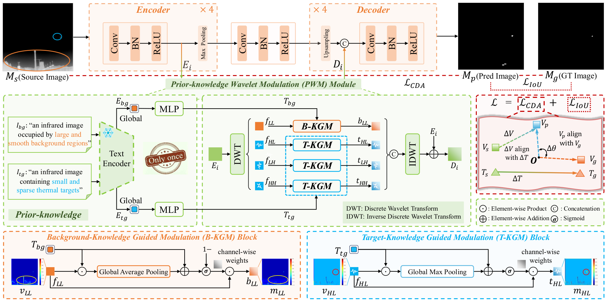
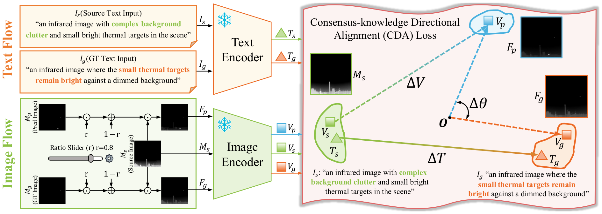
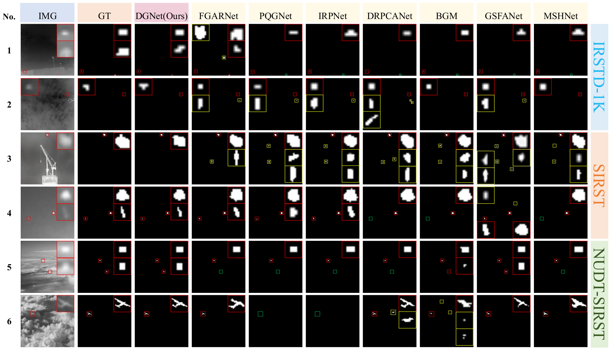

<div align="center">

<h2 align="center">
  <b>(ACM MM-2026) DGNet: Dual-knowledge Guided Network for Infrared Small Target Detection</b>
</h2>
<div>
Chenglong&#160;Yu<sup>1</sup>,
Mingzhu&#160;Xu<sup>1&#9993;</sup>,
Jing&#160;Wang<sup>1</sup>,
Tongtong&#160;Wang<sup>1</sup>,
Pingping&#160;Miao<sup>1</sup>,
Liqiang&#160;Nie<sup>2</sup>
</div>
<sup>1</sup>School of Software, Shandong University&#160;&#160;&#160;
<sup>2</sup>Harbin Institute of Technology, Shenzhen
<br />
<sup>&#9993;&#160;</sup>Corresponding author
<br />
<div align="center">
  <a href="./paper/2026_MM_DGNet_Submit.pdf">
    
  </a>
  <a href="">
    
  </a>
  <a href="https://drive.google.com/drive/folders/1LXlRvlQWsKk58WpTgLWF1RqaPwOatKWF?usp=drive_link">
    
  </a>
  <a href="https://github.com/iLearn-Lab/MM26-DGNet" target="_blank">
        
    </a>
</div>

</div>

## 📢 Updates

- 🏆 **[08/2026]** DGNet checkpoints for all three datasets are included.
- 💻 **[08/2026]** **Source code** is now publicly available.
- 🎉 **[07/2026]** Our paper was accepted by **ACM Multimedia 2026 (ACM MM 2026)**.

## 📖 Introduction

InfRared Small Target Detection (IRSTD) aims to segment weak and tiny targets from complex infrared backgrounds. Existing text-guided approaches often use one image-specific description for both the target and background. This can entangle two different objectives—target enhancement and background suppression—and can require an external vision-language model during inference.

DGNet addresses these limitations with multiple generalizable texts and two complementary forms of knowledge:

- **Prior knowledge:** the Prior-knowledge Wavelet Modulation (**PWM**) module uses separate fixed descriptions for large, smooth backgrounds and small, sparse targets. Background-Knowledge Guided Modulation (**B-KGM**) suppresses low-frequency background features, while Target-Knowledge Guided Modulation (**T-KGM**) enhances high-frequency target features.
- **Consensus knowledge:** the Consensus-knowledge Directional Alignment (**CDA**) loss constructs a shared optimization direction from a cluttered source state to an ideal target-enhanced state in the frozen CLIP embedding space.

DGNet uses a four-stage encoder-decoder with PWM modules on its skip connections. The fixed PWM prompt features are precomputed. Therefore, neither the CLIP text encoder nor the CLIP image encoder is executed during inference.

This repository provides:

- 💻 DGNet training and inference code
- 🏆 Released checkpoints for three public datasets
- 📈 IoU, Pd, Fa, and ROC evaluation
- 🧠 CDA Loss and PWM text-feature preparation code

## 🧠 Method / Framework

<p align="center">
  
</p>

<p align="center">
  <b>Figure 1. Overall architecture of DGNet.</b>
</p>

<p align="center">
  
</p>

<p align="center">
  <b>Figure 2. Consensus-knowledge Directional Alignment Loss.</b>
</p>

## 📁 Project Structure

```text
DGNet-MM26/
├── Figs/
│   ├── Overview.png
│   ├── Qualitative_sota.png
│   └── CDA-Loss.png
├── datasets/
│   ├── IRSTD-1K/
│   │   ├── images/                    # Original infrared images
│   │   ├── masks/                     # Ground-truth masks
│   │   └── img_idx/                   # Training and testing splits
│   │       ├── train_IRSTD-1K.txt
│   │       └── test_IRSTD-1K.txt
│   ├── NUDT-SIRST/ 
│   └── SIRST/
├── model/
│   ├── dgnet/
│   │   ├── dgnet.py                # DGNet encoder-decoder
│   │   ├── pwm.py                  # PWM, B-KGM, and T-KGM
│   │   └── wavelet.py              # DWT and inverse DWT
│   └── wrapper.py                  # DGNet and IoU-loss wrapper
├── weights/
│   ├── best_IRSTD-1K.pth.tar
│   ├── best_SIRST.pth.tar
│   ├── best_NUDT-SIRST.pth.tar
│   └── dgnet_text_features.pth
├── cda_loss.py                     # CDA Loss
├── dataset.py                      # Dataset loader and augmentation
├── losses.py                       # IoU Loss
├── metrics.py                      # IoU, Pd, and Fa metrics
├── prepare_text_features.py        # Fixed PWM feature exporter
├── roc.py                          # ROC and AUC evaluation
├── train.py                        # Training entry point
├── test.py                         # Evaluation entry point
├── requirements.txt
├── README.md
└── LICENSE
```

## ⚙️ Installation

### 📥 1. Obtain the Repository

The public repository URL will be added after release. From the extracted source package, enter the project directory:

```bash
git clone https://github.com/iLearn-Lab/MM26-DGNet.git
cd MM26-DGNet
```

### 🧪 2. Create the Environment

The code was validated in the CodeV environment with Python 3.10.20, PyTorch 2.8.0, torchvision 0.23.0, and CUDA 12.8.

```bash
conda create -n dgnet python=3.10 -y
conda activate dgnet

# This command reproduces the PyTorch build used by the CodeV environment.
pip install torch==2.8.0 torchvision==0.23.0 \
  --index-url https://download.pytorch.org/whl/cu128
pip install -r requirements.txt
```

A CUDA-capable GPU is required by the provided training and evaluation entry points.

### 📦 3. Install OpenAI CLIP for CDA Loss

CDA Loss uses the original [OpenAI CLIP](https://github.com/openai/CLIP) implementation during training:

```bash
git clone https://github.com/openai/CLIP.git
cd CLIP
python setup.py install
cd ..
```

By default, `clip.load("ViT-B/32")` downloads and caches the OpenAI ViT-B/32 checkpoint. On an offline machine, pass a local checkpoint using `--clip_model /path/to/ViT-B-32.pt`.

OpenAI CLIP is required for training because CDA Loss uses its frozen image and text encoders. It is not required for evaluation.

### 🤗 4. Prepare the Fixed PWM Text Features

The included `weights/dgnet_text_features.pth` contains the two fixed 512-dimensional CLIP text features used by PWM. Evaluation loads this file directly.

To regenerate it, download the [ModelScope CLIP ViT-B/32 mirror](https://modelscope.cn/models/openai-mirror/clip-vit-base-patch32):

```bash
git lfs install
git clone https://www.modelscope.cn/openai-mirror/clip-vit-base-patch32.git

python prepare_text_features.py \
  --model_path ./clip-vit-base-patch32 \
  --output ./weights/dgnet_text_features.pth
```

The prior prompts defined in the paper are:

```text
an infrared image occupied by large and smooth background regions
an infrared image containing small and sparse thermal targets
```

## 🗂️ Datasets

All experiments in the paper use three public infrared small-target datasets. IRSTD-1K and NUAA-SIRST are divided into training and testing sets at an approximately 4:1 ratio. NUDT-SIRST is divided approximately equally.

| Dataset | Description | Images | Train / test | Source |
| --- | --- | ---: | ---: | --- |
| IRSTD-1K | Real infrared scenes with diverse targets and complex backgrounds | 1,001 | 800 / 201 | [ISNet repository](https://github.com/RuiZhang97/ISNet) |
| NUAA-SIRST | Real single-frame infrared images; also referred to as SIRST | 427 | 341 / 86 | [SIRST repository](https://github.com/YimianDai/sirst) |
| NUDT-SIRST | Synthesized 256×256 infrared images with varied target characteristics | 1,327 | 663 / 664 | [DNANet repository](https://github.com/YeRen123455/Infrared-Small-Target-Detection) |

The datasets are not redistributed in this repository. Please download them from their public sources and follow their original licenses and citation requirements.

## 🏆 Released Checkpoints / Models

The following results are reported in Table 1 of the paper. The corresponding checkpoints are included in `weights/`.

| Dataset | IoU (%) ↑ | Pd (%) ↑ | Fa (×10⁻⁶) ↓ | Checkpoint |
| :---: | ---: | ---: | ---: | :---: |
| IRSTD-1K | 72.72 | 93.88 | 4.25 | [`best_IRSTD-1K.pth.tar`](https://drive.google.com/file/d/1nFQDGIoQ7wghey1P3VFK-aOkPUSEPfNt/view?usp=drive_link) |
| NUAA-SIRST | 82.68 | 100.00 | 1.24 | [`best_SIRST.pth.tar`](https://drive.google.com/file/d/1fLs8ML9f6AUPDz8C7Qz-2Zzhiyb0YU_H/view?usp=drive_link) |
| NUDT-SIRST | 95.78 | 99.37 | 1.19 | [`best_NUDT-SIRST.pth.tar`](https://drive.google.com/file/d/11Je0H8egu5GRwYor5ULu9j8FOoBXJMfr/view?usp=drive_link) |

Visualization results can be found here：[DGNet\_Visual\_Result](https://drive.google.com/drive/folders/1OBJl1AcUSZvrReiCoIUZ-VLjXcU6aYuh?usp=drive_link)

## 🚀 Usage

### 🏋️ Training

Before training, install OpenAI CLIP, prepare the datasets, and ensure that `weights/dgnet_text_features.pth` is present. The following command starts a new IRSTD-1K training run with randomly initialized DGNet parameters:

```bash
python train.py \
  --dataset_dir ./datasets \
  --trainset IRSTD-1K \
  --testset IRSTD-1K \
  --batch_size 16 \
  --epochs 600 \
  --num_workers 8 
```

> Replace `IRSTD-1K` with `NUDT-SIRST` or `SIRST` when training on another dataset.


### 🔍 Evaluation and Inference

OpenAI CLIP and the downloaded Transformers model are not needed for inference. Only the included fixed text-feature file is loaded.

To evaluate all three released checkpoints in one command without saving binary masks:

```bash
python test.py \
  --dataset_dir ./datasets \
  --testset IRSTD-1K/NUAA-SIRST/NUDT-SIRST \
  --weights_dir ./weights \
  --no_save_output 
```

For these three datasets, `--checkpoint` can be omitted because `test.py` automatically maps each dataset to its corresponding file in `weights/`. When an explicit `--checkpoint` is supplied, test only the matching dataset in that command.

Binary prediction masks are saved under `outputs/<dataset>/` by default. Pass `--no_save_output` to calculate metrics without saving masks. Testing only reads the released checkpoint and does not overwrite it.

### 📈 ROC and AUC Evaluation

ROC must be calculated from continuous probabilities rather than thresholded binary masks. Pass `--save_mat` during inference to save the sigmoid output before thresholding:

```bash
python test.py \
  --dataset_dir ./datasets \
  --testset IRSTD-1K \
  --checkpoint ./weights/best_IRSTD-1K.pth.tar \
  --save_mat --no_save_output 

python roc.py \
  --prediction_dir ./outputs/IRSTD-1K/mats \
  --mask_dir ./datasets/IRSTD-1K/masks \
  --bins 100 \
  --output ./outputs/IRSTD-1K/roc_metrics.npz
```

## 🖼️ Visualization

The following figure presents qualitative comparisons between **DGNet** and representative SOTA infrared small target detection methods on **IRSTD-1K**, **SIRST**, and **NUDT-SIRST**.

<p align="center">
  
</p>

<p align="center">
  <b>Figure 2. Qualitative comparisons of different methods on the IRSTD-1K, SIRST, and NUDT-SIRST datasets.</b>
</p>


## 📚 Citation

If you find this project useful, please consider citing the paper:

```bibtex
@inproceedings{yu2026dgnet,
  title     = {DGNet: Dual-knowledge Guided Network for Infrared Small Target Detection},
  author    = {Yu, Chenglong and Xu, Mingzhu and Wang, Jing and Wang, Tongtong and Miao, Pingping and Nie, Liqiang},
  booktitle = {Proceedings of the ACM International Conference on Multimedia},
  year      = {2026},
}
```

Please also consider checking out and citing our other related work:

```bibtex
@inproceedings{wang2026adgnet,
  title     = {ADGNet: Asymmetric Dual-text Guided Network for Infrared Small Target Detection},
  author    = {Wang, Tongtong and Xu, Mingzhu and Yu, Chenglong and Wang, Jing and Lin, Xiaohui and Guan, Weili},
  booktitle = {Proceedings of the ACM International Conference on Multimedia},
  year      = {2026},
}

@article{11017756,
  author  = {Xu, Mingzhu and Yu, Chenglong and Li, Zexuan and Tang, Haoyu and Hu, Yupeng and Nie, Liqiang},
  journal = {IEEE Transactions on Geoscience and Remote Sensing},
  title   = {HDNet: A Hybrid Domain Network With Multiscale High-Frequency Information Enhancement for Infrared Small-Target Detection},
  year    = {2025},
  volume  = {63},
  pages   = {1--15},
  doi     = {10.1109/TGRS.2025.3574962},
}
```
## 🛠️ IRSTD-AutoLabel

In addition, we have open-sourced an automated annotation tool for infrared small target detection, **IRSTD-AutoLabel**. Interested readers are encouraged to visit the project page for more details and usage instructions:

> Project: https://github.com/iLearn-Lab/IRSTD-AutoLabel

## 📄 License

This project is released under the [Apache License 2.0](./LICENSE).

You may use, modify, and distribute the code in accordance with the terms of the license. Please retain the original license and attribution notices in redistributed or modified versions.

## 📧 Q@A
If you have any questions, please contact yucl@mail.sdu.edu.cn.